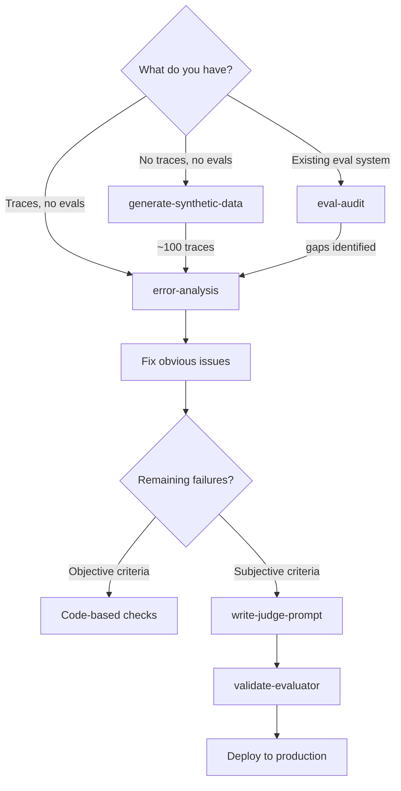
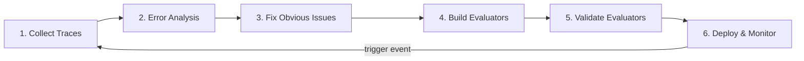
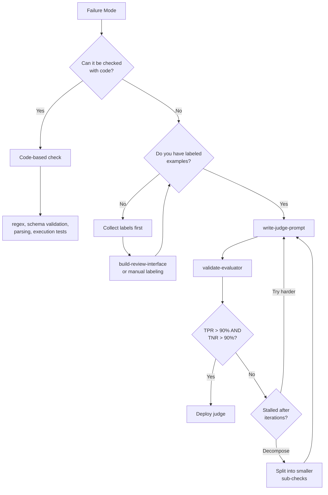
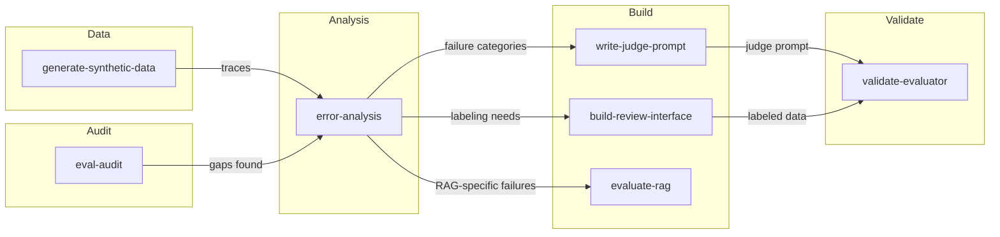

# AI Engineer's Guide to Evaluating and Improving AI Systems

A practitioner's guide for using the eval skills to build a continuous improvement loop around your LLM pipeline. This document covers *how* to use the skills together -- for details on *what* each skill does, see [skills-overview.md](skills-overview.md).

---

## Core Principles

Before diving into workflows, internalize these five rules. They are the most common mistakes made by teams building evals, distilled into actionable defaults.

1. **Observe before you measure.** Read traces before picking metrics. You cannot evaluate what you have not seen fail.
2. **Fix before you evaluate.** If the prompt never asked for the behavior, add the instruction. If a tool is missing, add it. Only build evaluators for failures that persist after obvious fixes.
3. **Binary over scales.** Use Pass/Fail, not Likert scales (1-5). Binary forces a clear decision boundary, makes annotator agreement measurable, and enables bias correction.
4. **Code before judges.** Regex, schema validation, and execution tests are deterministic, free, and fast. Use LLM judges only for criteria that require interpretation.
5. **Validate before you trust.** Never deploy an LLM judge without measuring its TPR and TNR against human labels. An unvalidated judge may consistently miss failures.

---

## Getting Started: Three Entry Points

Where you start depends on what you already have.

### Path 1: Greenfield (no traces, no evals)

You just built an LLM-powered feature and have no production data yet.

1. **generate-synthetic-data** -- Define 3 dimensions targeting likely failure areas. Generate ~100 diverse queries. Run them through your pipeline to produce traces.
2. **error-analysis** -- Read the traces. Categorize failures. Fix the obvious ones.
3. Continue to the improvement loop below.

### Path 2: Existing pipeline, no evals

You have a working system with real user traffic but no evaluation infrastructure.

1. **error-analysis** -- Sample ~100 real traces (random is fine to start). Read them, categorize failures, compute failure rates.
2. Fix prompt gaps, missing tools, and bugs revealed by the analysis.
3. For remaining failures, build evaluators (code-based or judge) and validate them.

### Path 3: Inherited eval system

You joined a team or project with existing evals and you are not sure whether to trust them.

1. **eval-audit** -- Run the six diagnostic checks. The audit will tell you what is broken and which skill to use to fix it.
2. The audit typically leads back to **error-analysis** (the most common gap).

---

## The Continuous Improvement Loop

Evals are not a one-time setup. They are a feedback loop you run continuously as your system evolves.

### Step 1: Collect Traces

- **Real data preferred.** Sample from production using stratified sampling across key dimensions (query type, user segment, feature area).
- **Synthetic data when needed.** Use **generate-synthetic-data** to fill gaps in underrepresented query types or when production volume is low.
- **Target ~100 traces** for each round of analysis.

### Step 2: Error Analysis

- Use **error-analysis** to read traces and categorize failures.
- Let categories emerge from observation, not brainstorming.
- Involve a domain expert for the first 30-50 traces.
- Output: 5-10 failure categories with computed failure rates.

### Step 3: Fix Obvious Issues

Before building any evaluator, check each failure category:
- Is the prompt missing an instruction? Add it.
- Is a tool missing or misconfigured? Fix it.
- Is there an engineering bug? Fix the code.

Many failure categories disappear at this step.

### Step 4: Build Evaluators

For each failure that persists after fixing:

- **Code-based check** if the criterion is objective (format validation, constraint satisfaction, schema conformance).
- **write-judge-prompt** if the criterion requires interpretation (tone, faithfulness, relevance, completeness). Build one judge per failure mode, not one judge for everything.

### Step 5: Validate Evaluators

- Use **validate-evaluator** to calibrate each LLM judge against human labels.
- Target TPR > 90% and TNR > 90% on the dev set.
- Run the test set exactly once for the final unbiased measurement.
- Apply bias correction (Rogan-Gladen) when reporting aggregate production pass rates.

### Step 6: Deploy and Monitor

- Pin exact model versions for all LLM judges.
- Track corrected pass rates with confidence intervals over time.
- Set alerts for widening confidence intervals or sudden metric shifts.

---

## Scenario Walkthroughs

### Scenario A: "I just built a chatbot and need evals from scratch"

| Step | Skill | What you do | Output |
|------|-------|-------------|--------|
| 1 | generate-synthetic-data | Define dimensions (intent type, user persona, edge cases). Generate 100 queries. Run through pipeline. | 100 traces |
| 2 | error-analysis | Read all traces with a domain expert. Categorize failures. | 7 failure categories, failure rates |
| 3 | -- | Fix 3 categories by updating the prompt and adding a missing tool. | 4 categories remaining |
| 4 | write-judge-prompt | Build judges for "wrong tone" and "missed user constraints". Code checks for "malformed JSON" and "missing required fields". | 2 judges + 2 code checks |
| 5 | validate-evaluator | Collect 100 labeled traces (50 Pass, 50 Fail). Validate both judges. | TPR/TNR scores, bias-corrected rates |

### Scenario B: "My RAG pipeline quality dropped after a model switch"

| Step | Skill | What you do | Output |
|------|-------|-------------|--------|
| 1 | error-analysis | Sample 100 recent traces (post-switch). Compare failure categories to pre-switch baseline. | New/shifted failure categories |
| 2 | evaluate-rag | Separate retrieval from generation failures. Measure Recall@k for retrieval, faithfulness for generation. | Diagnostic: retrieval is fine, generation hallucinating from context |
| 3 | write-judge-prompt | Build a faithfulness judge specific to the new hallucination pattern. | 1 judge prompt |
| 4 | validate-evaluator | Validate against expert labels. | Confirmed TPR 93%, TNR 91% |
| 5 | -- | Use the judge to measure hallucination rate. Iterate on the generation prompt until rate drops. | Improved pipeline |

### Scenario C: "I inherited an eval system and don't trust it"

| Step | Skill | What you do | Output |
|------|-------|-------------|--------|
| 1 | eval-audit | Run all six diagnostic checks against existing artifacts. | Findings: no error analysis done, judges unvalidated, using Likert scales |
| 2 | error-analysis | Start from scratch with 100 production traces. | Application-grounded failure categories |
| 3 | write-judge-prompt | Rewrite judges as binary Pass/Fail targeting specific failure modes. | Rewritten judge prompts |
| 4 | validate-evaluator | Validate each rewritten judge. | TPR/TNR scores confirming improvement over old judges |

### Scenario D: "I need to scale human review beyond my team"

| Step | Skill | What you do | Output |
|------|-------|-------------|--------|
| 1 | error-analysis | Complete error analysis to establish failure categories and labeling rubric. | Categories + definitions |
| 2 | build-review-interface | Build a custom annotation app rendering traces in domain-native format. Add Pass/Fail buttons, failure mode tags from Step 1. | Annotation web app |
| 3 | -- | Domain experts label 100+ traces using the interface. | Labeled dataset |
| 4 | validate-evaluator | Use labeled data to validate existing or new judges. | Validated evaluators |

---

## Decision Guide: Choosing the Right Evaluator Type

For each failure mode identified in error analysis, choose the evaluator type:

**Rules of thumb:**
- Format validation, constraint satisfaction, keyword presence, schema conformance --> **code-based**
- Tone, faithfulness, relevance, completeness, nuanced correctness --> **LLM judge**
- Safety-critical checks --> **both** (code check as hard gate + judge as additional signal)
- If a judge cannot reach 80% TPR/TNR after multiple iterations --> **decompose** the criterion into smaller, more atomic checks

---

## Common Pitfalls

These anti-patterns span multiple skills. Each one is a common trap for engineers setting up evals.

| Pitfall | What goes wrong | What to do instead |
|---------|-----------------|-------------------|
| Brainstorming failure categories | You get generic categories ("hallucination", "helpfulness") that miss your actual failures | Read traces first, let categories emerge from observation |
| Holistic judges | A single judge evaluating "overall quality" produces unactionable verdicts | One judge per failure mode, each with explicit Pass/Fail definitions |
| Likert scales | Annotators disagree on 3 vs 4, judges inherit the noise, scores cannot be calibrated | Binary Pass/Fail only. Use multiple binary judges if you need granularity |
| Skipping validation | An unvalidated judge may always say "Pass" and you would never know | Always measure TPR/TNR before trusting any judge |
| Raw accuracy as alignment metric | With 90% Pass rate, a judge that always says Pass gets 90% accuracy but catches zero failures | Use TPR and TNR separately |
| Using dev/test data as few-shot examples | Inflated alignment scores that hide real judge failures | Strict train/dev/test split; few-shots come only from train |
| Building evaluators before fixing bugs | You spend effort measuring a failure that a one-line prompt fix would eliminate | Fix obvious prompt gaps, missing tools, and code bugs first |
| ROUGE/BERTScore as primary metric | Surface-level overlap does not measure correctness | Binary evaluators grounded in specific failure modes |
| One-time error analysis | Failure modes shift after every pipeline change | Re-run after model switches, prompt rewrites, new features, and incidents |
| Reviewing only final output | You cannot see where the pipeline broke | Show the full trace: input, intermediate steps, tool calls, and final output |

---

## When to Re-run the Loop

Return to Step 1 (Collect Traces) and repeat the full cycle when any of these events occur:

- **Model switch** -- New models have different failure profiles. Old evaluators may not catch new failure types.
- **Prompt rewrite** -- Changed instructions shift which failures appear and which disappear.
- **New feature or tool** -- Additional capabilities introduce new failure modes.
- **Production incident** -- An incident signals a failure mode your current evals missed.
- **Metrics drift** -- Corrected pass rates trend downward or confidence intervals widen.
- **Stale labels** -- Your labeled dataset no longer represents current production traffic patterns.

A healthy cadence: re-run error analysis on a fresh sample at least once per major release, or monthly for systems with frequent changes.

---

## Skill Dependency Chain

For quick reference, here is the typical order of skill usage and what each one requires:

| Skill | Requires | Produces |
|-------|----------|----------|
| generate-synthetic-data | Application description, dimension definitions | ~100 diverse traces |
| error-analysis | ~100 traces | Failure categories, failure rates, fix/evaluate decisions |
| write-judge-prompt | One failure mode + 20+ labeled Pass/Fail examples | Binary judge prompt |
| validate-evaluator | Judge prompt + ~100 labeled traces (50 Pass, 50 Fail) | TPR/TNR scores, bias-corrected production estimates |
| evaluate-rag | RAG pipeline traces | Retrieval metrics, generation quality diagnosis |
| build-review-interface | Trace data (JSON/CSV) | Annotation web app |
| eval-audit | Existing eval artifacts (or none) | Prioritized findings report |
