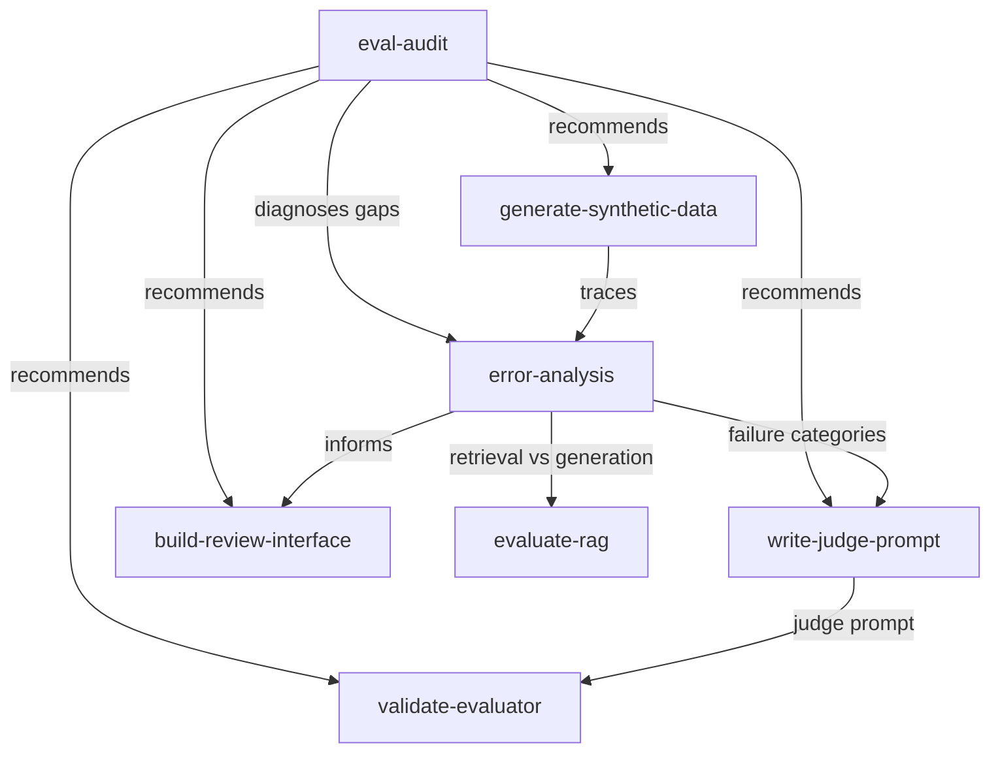
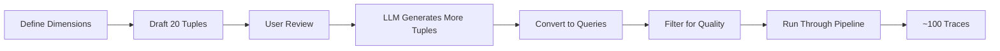
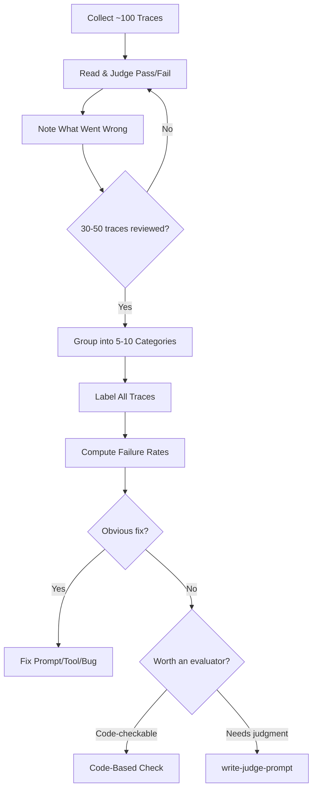
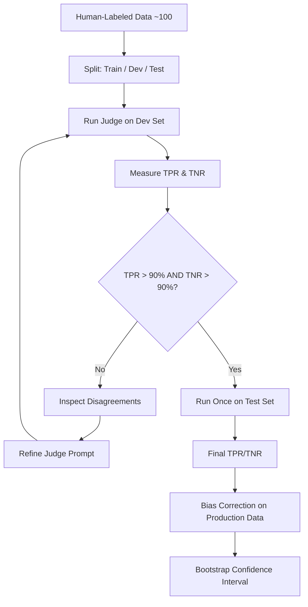
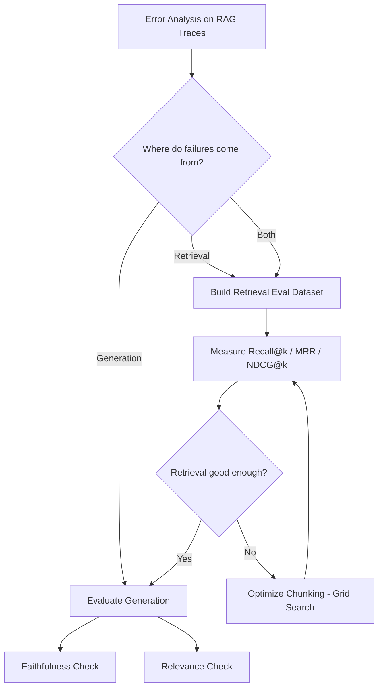

# AI Evals Skills Overview

This document provides a one-pager overview of each AI evaluation skill for LLM pipelines. The 7 skills cover the full eval lifecycle: from generating test data through error analysis, building evaluators, validating them, and auditing existing pipelines.

## How the Skills Fit Together

---

## 1. generate-synthetic-data

**Purpose:** Create diverse, realistic test inputs for LLM pipeline evaluation using dimension-based tuple generation.

**Use when:** Bootstrapping an eval dataset, real user data is sparse, or stress-testing specific failure hypotheses.

**Do NOT use when:** You already have 100+ representative real traces (use stratified sampling instead), or the task is collecting production logs.

**What it does:**
- Defines 3+ dimensions (axes of variation) targeting anticipated failure-prone areas of the pipeline
- Drafts 20 tuples (dimension-value combinations) with user review to ensure realism
- Scales up tuple generation via LLM prompting while avoiding duplicates
- Converts each tuple to a natural-language query in a separate step (two-step process avoids repetitive phrasing)
- Filters generated queries for quality and realism (manual or LLM-rated)
- Runs all queries through the full LLM pipeline, capturing complete traces (input, intermediate steps, tool calls, final output)
- Targets ~100 high-quality, diverse traces for saturation
- Supports stratified sampling of real user data when available (embedding clustering, K-means)

---

## 2. error-analysis

**Purpose:** Systematically identify and categorize failure modes in an LLM pipeline by reading traces.

**Use when:** Starting a new eval project, after significant pipeline changes (new features, model switches, prompt rewrites), when production metrics drop, or after incidents.

**What it does:**
- Collects ~100 representative traces (real or synthetic via generate-synthetic-data)
- Presents each trace to the user for binary Pass/Fail judgment
- Records what went wrong for each failure, focusing on the root cause (first thing that went wrong)
- Groups similar failures into 5-10 distinct, actionable categories after reviewing 30-50 traces
- Optionally uses LLM-assisted clustering to suggest groupings (always reviewed by user)
- Labels every trace against the finalized failure categories (binary per category)
- Computes failure rates to prioritize what to fix
- Triages each failure: fix obvious problems first (prompt gaps, missing tools, bugs), then decide which failures warrant an evaluator
- Prefers code-based checks for objective criteria; reserves LLM judges for subjective criteria
- Iterates 2-3 rounds of reviewing and refining categories
- Stops when new traces stop revealing new failure types (~last 20 traces yield nothing new)

---

## 3. write-judge-prompt

**Purpose:** Design a binary Pass/Fail LLM-as-Judge evaluator for one specific failure mode that requires interpretation.

**Use when:** A failure mode requires judgment (tone, faithfulness, relevance, completeness) and cannot be checked with code.

**Do NOT use when:** The failure mode can be checked with code (regex, schema validation, execution tests), or you need to validate/calibrate the judge (use validate-evaluator).

**What it does:**
- Builds a judge prompt with exactly four components:
  1. **Task and evaluation criterion** - states the single failure mode being evaluated
  2. **Pass/Fail definitions** - explicit binary definitions derived from error analysis
  3. **Few-shot examples** - labeled Pass, Fail, and borderline cases from the training split (2-4 typical, plateaus after 4-8)
  4. **Structured output format** - JSON with critique-before-verdict (forces reasoning before decision)
- Ensures each judge checks exactly one failure mode (no holistic evaluations)
- Selects only the minimal context needed for each failure mode (e.g., persona + email for tone, context + answer for faithfulness)
- Enforces structured output via provider schema enforcement (OpenAI response_format, Anthropic tool definitions) or libraries (Instructor, Outlines)
- Recommends starting with the most capable model available and optimizing for cost later
- Guards against common pitfalls: vague criteria, Likert scales, missing few-shot examples, data leakage from dev/test sets

---

## 4. validate-evaluator

**Purpose:** Calibrate an LLM judge against human judgment using data splits, TPR/TNR measurement, and bias correction.

**Use when:** After writing a judge prompt (write-judge-prompt) and before trusting its outputs in production.

**Do NOT use when:** Evaluating code-based evaluators (those are deterministic; test with standard unit tests).

**What it does:**
- Splits ~100 human-labeled traces into train (10-20%), dev (40-45%), and test (40-45%) sets
- Uses training examples exclusively as few-shot sources for the judge prompt
- Runs the judge on the dev set and measures TPR (True Positive Rate) and TNR (True Negative Rate)
- Inspects every disagreement between judge and human labels (False Pass = too lenient, False Fail = too strict)
- Iterates on judge prompt (wording, examples, rules) until TPR > 90% AND TNR > 90% on dev set
- Runs the judge exactly once on the held-out test set for final unbiased measurement
- Applies Rogan-Gladen bias correction formula to estimate true success rates on production data
- Computes bootstrap confidence intervals for the corrected estimate
- Supports the `judgy` Python library for streamlined estimation
- Requires pinning exact model versions for reproducibility

---

## 5. evaluate-rag

**Purpose:** Guide evaluation of RAG pipeline retrieval and generation quality separately.

**Use when:** Evaluating a retrieval-augmented generation system, measuring retrieval quality, assessing generation faithfulness/relevance, generating synthetic QA pairs for retrieval testing, or optimizing chunking strategies.

**What it does:**
- Starts with error analysis on end-to-end traces to determine whether failures come from retrieval, generation, or both
- Evaluates retrieval and generation as separate components
- **Retrieval evaluation:**
  - Builds a retrieval evaluation dataset (queries paired with ground-truth relevant chunks)
  - Supports manual curation and synthetic QA generation (including adversarial questions with distractor chunks)
  - Measures Recall@k (first-pass retrieval), Precision@k (reranking), MRR (single-fact lookups), NDCG@k (graded relevance)
  - Evaluates multi-hop retrieval with Two-hop Recall@k
- **Chunking optimization:**
  - Treats chunking as a tunable hyperparameter via grid search (chunk size x overlap)
  - Supports content-aware chunking using natural document boundaries
- **Generation evaluation:**
  - Assesses answer faithfulness (hallucinations, omissions, misinterpretations)
  - Assesses answer relevance (does it address the query?)
  - Provides diagnostic matrix: context relevance x faithfulness x answer relevance to pinpoint failure source

---

## 6. build-review-interface

**Purpose:** Build a custom browser-based annotation interface for reviewing LLM traces and collecting structured human feedback.

**Use when:** You need to build an annotation tool, review traces, or collect human labels.

**What it does:**
- Builds an HTML page that loads traces from JSON/CSV, displays one trace at a time
- **Data display:**
  - Renders all data in native format (markdown as HTML, code with syntax highlighting, JSON pretty-printed, tables as HTML tables)
  - Color-codes by role/status (user, assistant, tool calls, system prompts)
  - Collapses repetitive/verbose elements (system prompts, tool response JSON) behind toggles
  - Highlights key content (prices, dates, names) and extracts metadata as badges/headers
  - Shows full trace including intermediate steps, collapsed by default
- **Feedback collection:**
  - Binary Pass/Fail buttons as primary action
  - Free-text notes field
  - Defer button for uncertain cases
  - Auto-save on every action
- **Navigation:**
  - Next/Previous buttons and keyboard arrow keys
  - Trace counter with progress ("12 of 87 remaining")
  - Jump to specific trace by ID
  - Full keyboard shortcuts (1=Pass, 2=Fail, D=Defer, U=Undo)
- **Additional features:**
  - Reference panel for ground truth/rubric definitions
  - Filtering by metadata dimensions
  - Clustering by metadata or semantic similarity
- **Testing:**
  - Visual review via screenshots with representative data
  - Functional testing with Playwright (full annotation workflow)

---

## 7. eval-audit

**Purpose:** Audit an existing LLM eval pipeline and surface problems with concrete next steps.

**Use when:** Inheriting an eval system, unsure whether evals are trustworthy, or as a starting point when no eval infrastructure exists.

**Do NOT use when:** Building a new evaluator from scratch (use error-analysis, write-judge-prompt, or validate-evaluator instead).

**What it does:**
- Gathers eval artifacts (traces, evaluator configs, judge prompts, labeled data, dashboards) via observability MCP server or local files
- Runs diagnostic checks across six areas:
  1. **Error Analysis** - Was systematic error analysis done? Were categories observed from traces or brainstormed?
  2. **Evaluator Design** - Are evaluators binary? Do judges target specific failure modes? Are code-based checks used where possible? Are similarity metrics (ROUGE, BERTScore) misused?
  3. **Judge Validation** - Are judges validated against human labels? Is alignment measured with TPR/TNR (not raw accuracy)? Is there proper train/dev/test split without data leakage?
  4. **Human Review Process** - Are domain experts reviewing? Are they seeing full traces? Is data formatted for readability?
  5. **Labeled Data** - Is there enough labeled data (~100 for error analysis, ~50 Pass + ~50 Fail for validation)? Recommends sampling strategies (random, clustering, outlier, feedback-driven)
  6. **Pipeline Hygiene** - Is error analysis re-run after changes? Are evaluators maintained and re-validated?
- Handles the "no eval infrastructure" case by directing to error-analysis (or generate-synthetic-data first)
- Produces a prioritized findings report ordered by impact, each finding linking to a specific skill or fix

---

## Quick Reference

| Skill | Primary Input | Primary Output | When to Use |
|-------|--------------|----------------|-------------|
| generate-synthetic-data | Dimension definitions, application description | ~100 diverse traces | No real data, sparse data, stress-testing |
| error-analysis | ~100 traces (real or synthetic) | Failure categories + failure rates | Starting evals, after pipeline changes, metrics drop |
| write-judge-prompt | Failure mode + labeled examples | Binary Pass/Fail judge prompt | Subjective failure modes needing interpretation |
| validate-evaluator | Judge prompt + ~100 human-labeled traces | TPR/TNR scores + bias-corrected estimates | Before trusting a judge in production |
| evaluate-rag | RAG pipeline traces | Retrieval metrics + generation quality assessment | Evaluating any RAG system |
| build-review-interface | Trace data (JSON/CSV) | Browser-based annotation app | Need human annotation at scale |
| eval-audit | Existing eval artifacts | Prioritized findings report | Inheriting or auditing eval pipelines |
